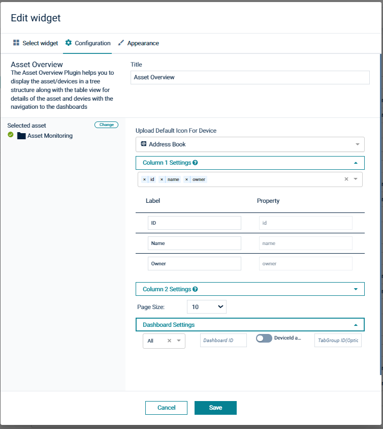

# Cumulocity Asset Overview widget plugin[](https://github.com/SoftwareAG/cumulocity-device-details-widget-plugin/releases/download/1.0.0/sag-ps-pkg-asset-overview-1.0.0.zip)

The Asset Overview Widget Plugin is the Cumulocity module federation plugin created using c8ycli.This plugin can be used 
in Application Builder or Cockpit.The Asset Overview Plugin helps you to display assets/devices in tree structure and data 
in the table view along with the navigation to the dashboards.


### Please choose Asset Viewer Widget release based on Cumulocity/Application builder version:

|APPLICATION BUILDER | CUMULOCITY | ASSET VIEWER WIDGET PLUGIN  |
|--------------------|------------|-----------------------------|
| 2.0.x              | >= 1018.x.x| 1.x.x                       |




## Features

*  **Display Assets/Devices:** Display Assets/Devices in tree structure mode.It also supports child devices/assets.

*  **Configurable Columns:** User can choose what to display in each page of tiles from available list and also option to display custom field.

*  **Dashboard Settings (App Builder only):** Ability to navigate to dashboard by providing dashboard Id.

*  **Custom Icon:**  Select and upload the icon for the device where default image is not available


## Prerequisites:
   Cumulocity c8ycli >=1018.x.x
   

## Installation

### Runtime Widget Deployment?

* This widget support runtime deployment. Download [Runtime Binary]() and install via Administrations --> Ecosystems --> Applications --> Packages 

## QuickStart

This guide will teach you how to add widget in your existing or new dashboard.

1. Open your application from App Switcher

2. Add new dashboard or navigate to existing dashboard

3. Click `Add Widget`

4. Search for `Asset Viewer`

5. Select `Target Assets or Devices`

7. Click `Save`

Congratulations! Asset Viewer is configured.


## User Guide


**How to start**
Run the command below to scaffold a `widget` plugin.

```
c8ycli new <yourPluginName> widget-plugin
```

As the app.module is a typical Cumuloctiy application, any new plugin can be tested via the CLI:

```
npm start -- --shell cockpit
```

In the Module Federation terminology, `widget` plugin is called `remote` and the `cokpit` is called `shell`. Modules provided by this `widget` will be loaded by the `cockpit` application at the runtime. This plugin provides a basic custom widget that can be accessed through the `Add widget` menu.

> Note that the `--shell` flag creates a proxy to the cockpit application and provides` WidgetPluginModule` as an `remote` via URL options.

Also deploying needs no special handling and can be simply done via `npm run deploy`. As soon as the application has exports it will be uploaded as a plugin.
