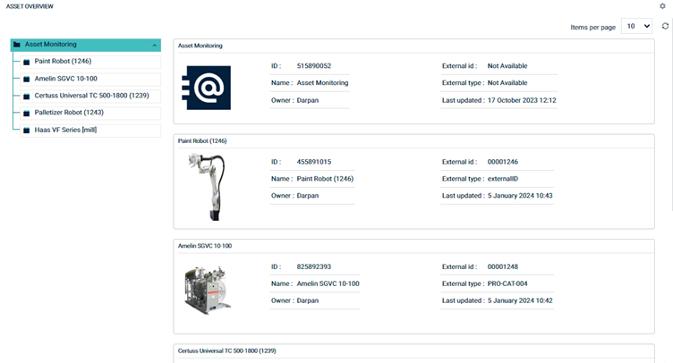

# Cumulocity Asset Overview Widget Plugin

The Asset Overview Widget Plugin is the Cumulocity module federation plugin created using c8ycli.This plugin can be used 
in Application Builder or Cockpit.The Asset Overview Plugin helps you to display assets/devices in tree structure and data 
in the table view along with the navigation to the dashboards.

### Please choose Asset Overview Widget release based on Cumulocity/Application builder version:

|APPLICATION BUILDER&nbsp;|&nbsp;CUMULOCITY&nbsp;|&nbsp;ASSET OVERVIEW WIDGET PLUGIN&nbsp;|
|--------------------|------------|-----------------------------|
| 2.0.x              | >= 1018.x.x| 1.x.x                       |

<kbd> </kbd>

<kbd> </kbd>

## Features

*  **Display Assets/Devices:** Display Assets/Devices in tree structure mode.It also supports child devices/assets.

*  **Display Assets/Devices in Tree Structure:** We can expand and collapse the hierrachal view of the tree structure.

*  **Pagination:** Configurable Paginations and also option to set default page size.You can change the page size in the UI also
     
*  **Configurable Columns:** User can choose what to display in each page of tiles from available list.

*  **Dashboard Settings (App Builder only):** Ability to navigate to dashboard by providing dashboard Id.

*  **Custom Icon:**  Select and upload the icon for the device where default image is not available.

## Prerequisites:
   Cumulocity c8ycli >=1018.x.x
   

## Installation

### Runtime Widget Deployment?

* This widget support runtime deployment. Download [Runtime Binary]() and install via Administrations --> Ecosystems  --> Extensions

## QuickStart

This guide will teach you how to add widget in your existing or new dashboard.

1. Open your application from App Switcher

2. Add new dashboard or navigate to existing dashboard

3. Click `Add Widget`

4. Search for `Asset Overview`

5. Select `Target Assets or Devices`

6. Follow the user guide and configure the relevant fields.

7. Click `Save`

Congratulations! Asset Overview is configured.

## User Guide

 
*  **Target assets or devices:** User can select a device/asset or device/asset group. If group is selected, list of devices/assets will be display in the tree strucure and details can be viewed in a table.
*  **UI Pagination:** User can select the page size from the UI using the drop down.
*  **Config Pagination:** User can select the page size from the configaration you can edit the plugin and set the page size.
*   **Upload Default Icon For Device:** User can select the drop down upload the icon for the device where default image is not available
*  **Column1 Settings:** User can select up to 5 fields to display in Column1 of tile.Based on that the asset or devices will be viewed as a table in the UI
*  **Column2 Settings:** User can select up to 5 fields to display in Column2 of tile.Based on that the asset or devices will be viewed as a table in the UI
*  **Refresh:** Useful for force reload/refresh devices.
*  **Dashboard Settings(Application Builder/Blue Print Forge):** This feature is available only in application builder. User can navigate to any other dashboard by providing below details:
    * **Device Type:** Select a device type. Navigation will be applied to all devices/assets of this device/asset type to a specific dashboard.
    * **Dashboard ID:** Dashboard ID of a dashboard where user need to navigate. You can find dashboard id in browser URL.
    * **DeviceId as TabGroup:** Select this option only if you are using Group Template as dashboard in application builder and selected deviceId as tabgroup field during group template configuration.
    * **TabGroup ID(optional):** If your dashboard is based on tabgroup then provide tabgroup id.

------------------------------

This widget is provided as-is and without warranty or support. They do not constitute part of the Software AG product suite. Users are free to use, fork and modify them, subject to the license agreement. While Software AG welcomes contributions, we cannot guarantee to include every contribution in the master project.
_____________________
For more information you can Ask a Question in the [TECH Community Forums](https://tech.forums.softwareag.com/tag/Cumulocity-IoT).
